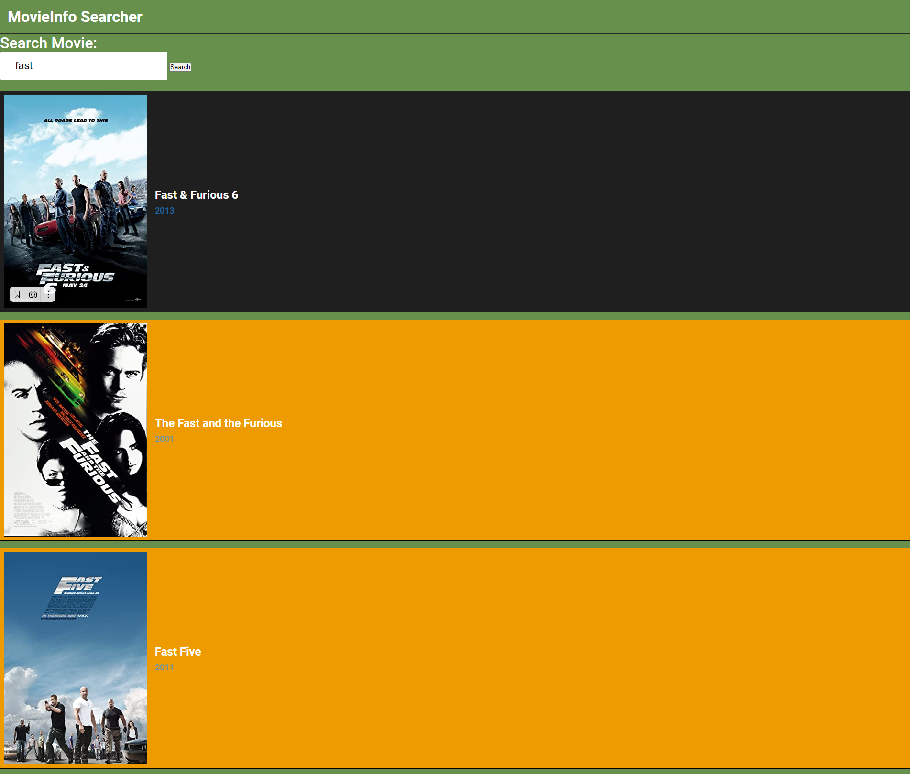
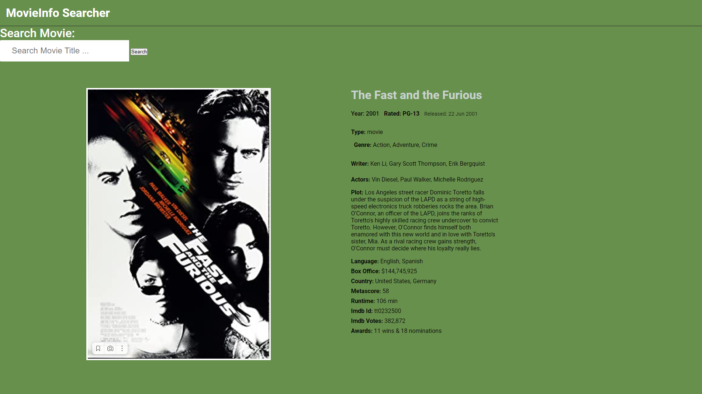

spring-boot-movie-searcher-omdb-api
Movie Searcher that use <b>OMDb API</b> to load and display movies info(Year, Name, Awards, Actors and etc.)

<b>Movie Searcher помогает найти нужный вам фильм по названию.</b>
Далее выпадает список фильмов с таким же названием, если кликнуть на интересующий вас фильм, то можно посмотреть всю информацию о фильме.

Приложение взаимодействует с OMDb API(http://www.omdbapi.com/).

Были использованы следующие технологии: Spring Boot, Google GSON(для работы с json). Оформление: html, css, js

<b>Демонстрация работы:</b>
 
 
1)Набираем в строке поиска нужное название:

 
 
 
2)После нажатия кнопки search выходит список из 10 фильмов(Картинку обрезал для наглядности)

 
 
 
3)После нажатия на искомый фильм выходит описание фильма.
